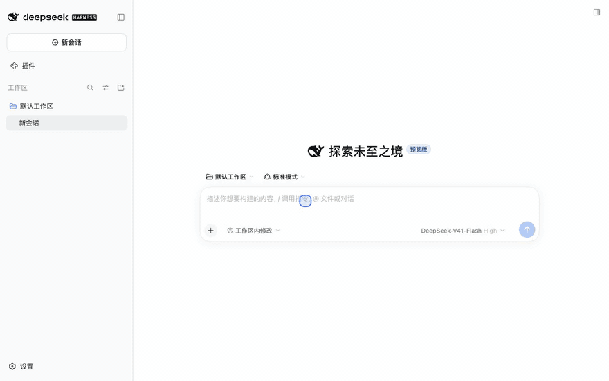
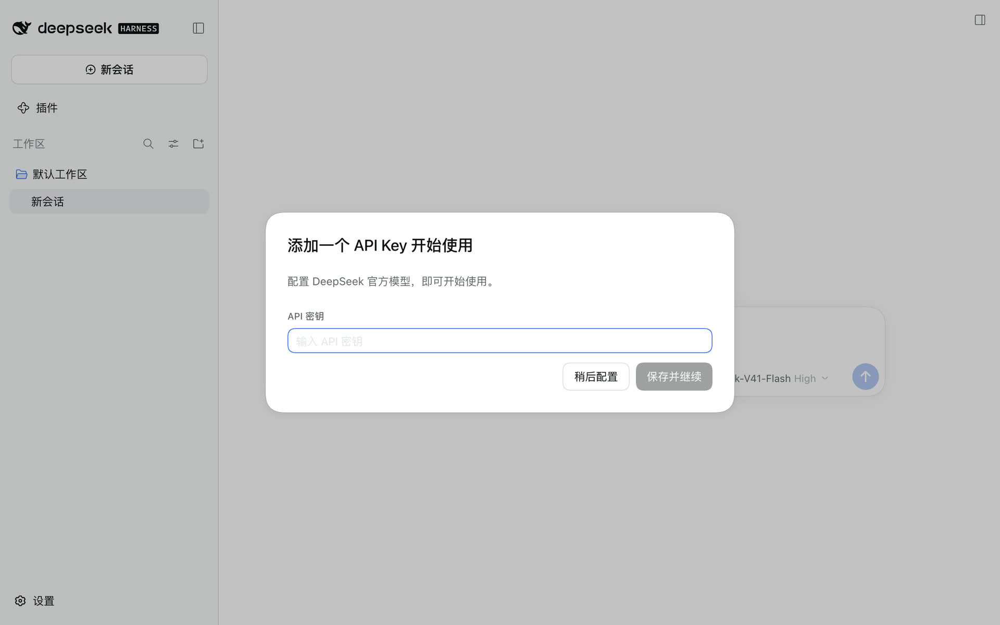
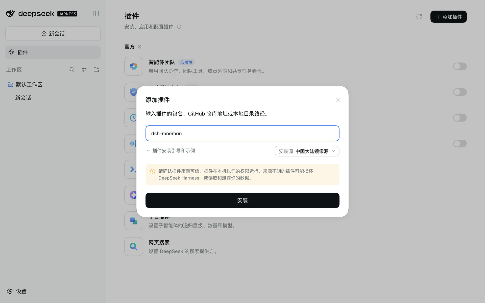
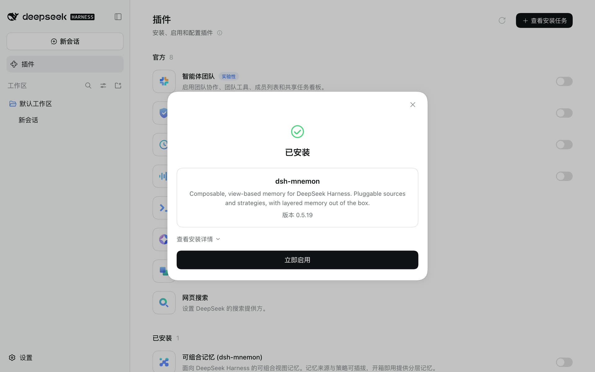
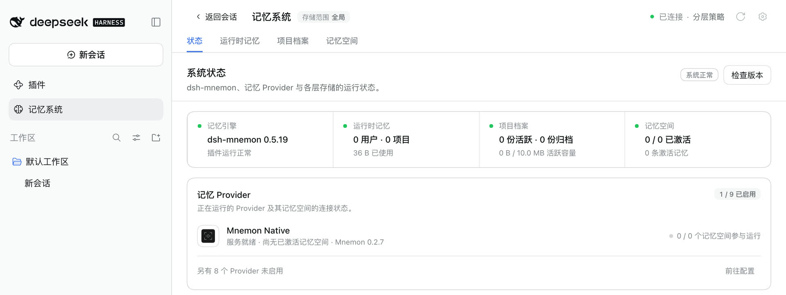
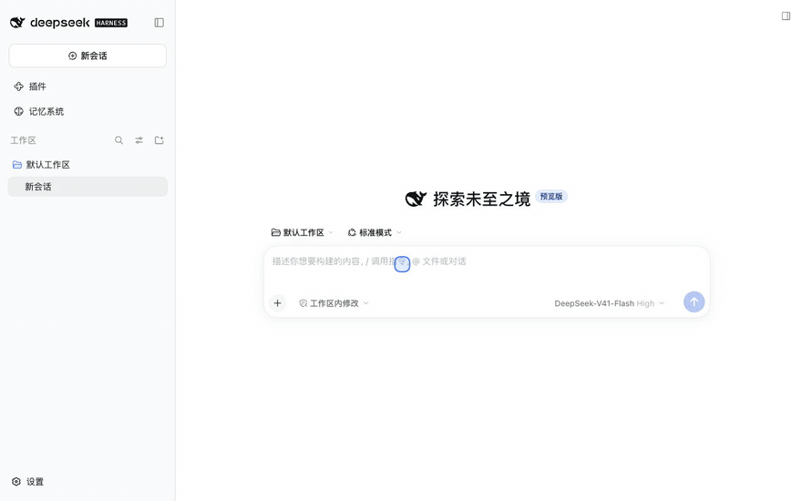
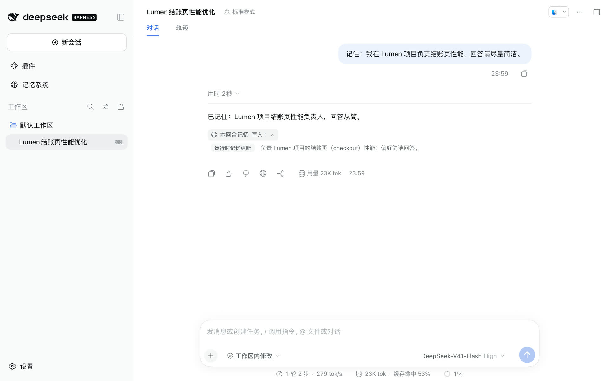
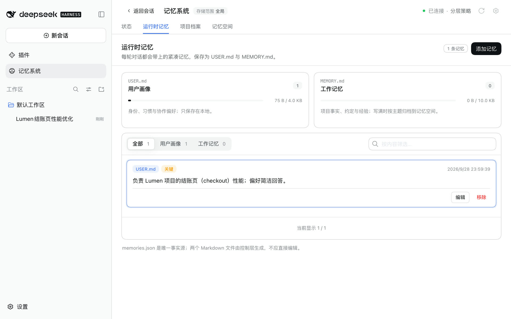
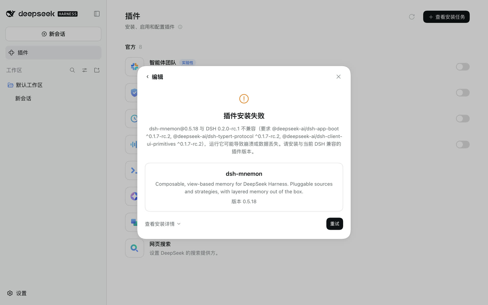
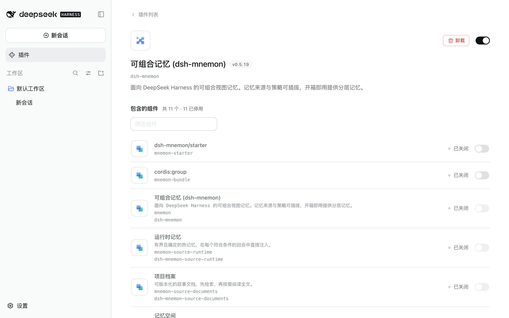

# 安装与启动

**简体中文** | [English](../../en/guides/installation.md) | [文档中心](../README.md)

本页写给第一次使用的你：从一台还没装过 DeepSeek Harness（DSH）的电脑开始，装好 dsh-mnemon，并让对话用上第一条记忆，大约需要 10 分钟。已经在用 DSH？直接跳到[第 3 步](#3-安装并启用-dsh-mnemon)。



本页截图与录屏来自真实的 DSH 0.2.0-rc.1 与 dsh-mnemon 0.5.19，采集方式见[安装图集](../../assets/install-v0.5.19/README.md)。

## 选择使用方式

| 方式 | 适合 | 在哪里安装 dsh-mnemon |
|---|---|---|
| **网页（推荐）** | 在浏览器中使用 DSH，最容易开始 | 网页左侧的**插件 → 添加插件** |
| **桌面版** | 已经装好 DeepSeek Harness 桌面版 | 桌面版左侧的**插件 → 添加插件**，见[桌面版](#6-桌面版) |
| **命令行与 Headless** | 服务器、脚本和一次性任务 | `dsh plugin --profile <名称> add dsh-mnemon`，见[命令行与 Headless](#7-命令行与-headless) |

三种方式安装的是同一个 dsh-mnemon。默认情况下，记忆保存在本机的 `~/.mnemon`，网页和桌面版共用这份记忆。

## 1. 准备 Node.js、pnpm 与 Mnemon CLI

| 工具 | 用途 | 是否必需 |
|---|---|---|
| [Node.js](https://nodejs.org/) 22.19 或更高（推荐 22 或 24 LTS） | 运行 DSH | 必需 |
| pnpm | DSH 安装插件时调用它；没有它，插件页会提示“没有找到 pnpm，无法安装” | 必需 |
| Mnemon CLI | 记忆空间默认的本地存储 Mnemon Native 需要它；运行时记忆与项目档案不需要 | 推荐，也可以以后再装 |

装好 Node.js 后，在终端（Windows 上为 PowerShell）中运行：

```sh
node --version
npm install --global pnpm
npm install --global @mnemon-dev/mnemon@latest
mnemon --version
```

两个 `--version` 都打印出版本号即可。Homebrew、Go 与 Windows 手工安装等方式见[Mnemon CLI 的其他安装方式](#mnemon-cli-的其他安装方式)。

## 2. 启动 DSH

```sh
npx @deepseek-ai/dsh web
```

DSH 在 `http://127.0.0.1:3080` 启动，并自动在浏览器中打开一个带一次性令牌的地址；终端里也会打印这个地址。使用期间保持终端开着，按 `Ctrl+C` 停止 DSH。

- 这条命令使用 npm 上 `latest` 标签的 DSH（撰写本文时为 0.1.7-rc.2）。想用 DSH 0.2 预览版，改用 `npx @deepseek-ai/dsh@next web`。dsh-mnemon 0.5.19 起两者都支持。
- 经常使用时可以全局安装：`npm install --global @deepseek-ai/dsh`，之后运行 `dsh web` 即可；[命令行方式](#7-命令行与-headless)也需要全局安装的 `dsh`。

第一次打开时：

1. DSH 0.2 会先显示**预览版说明**，点击**继续**。
2. 在**添加一个 API Key 开始使用**中粘贴你在 [DeepSeek 开放平台](https://platform.deepseek.com/) 创建的 API Key，点击**保存并继续**。也可以先点**稍后配置**，之后在**设置**中填写；安装插件不需要 Key，对话需要。

<p align="center"></p>

## 3. 安装并启用 dsh-mnemon

1. 点击左侧的**插件**，再点击右上角的**添加插件**。
2. 输入 `dsh-mnemon`，点击**安装**。对话框右侧的**安装源**由 DSH 自动选择：在中国大陆通常是**中国大陆镜像源**，在其他地区是 **npm 官方源**，一般不需要修改。
3. 几秒后显示**已安装**和版本号，点击**立即启用**。不需要重启 DSH。
4. 左侧出现**记忆系统**，安装就完成了。

| 输入包名并安装 | 安装完成，立即启用 |
|---|---|
|  |  |

“已安装”卡片中的简介来自软件包信息，所以是英文。插件列表中的名称与说明会跟随界面语言。

习惯命令行时，也可以用下面的命令安装，再按第 2 步启动 DSH；DSH 正在运行时，安装后需要重启它：

```sh
npx @deepseek-ai/dsh plugin --profile web add dsh-mnemon
```

## 4. 确认安装成功

点击**记忆系统**，默认打开**状态**页：

- 顶栏显示**已连接 · 分层策略**；
- **记忆引擎**卡片显示 `dsh-mnemon 0.5.19` 或更新的版本；
- 装好 Mnemon CLI 时，**记忆 Provider** 中的 Mnemon Native 显示“服务就绪”和 CLI 版本。没有装时显示“未找到 Mnemon CLI”，运行时记忆与项目档案照常使用。



## 5. 保存第一条记忆

1. 点击**新会话**，输入一句希望它记住的话，例如：`记住：我在 Lumen 项目负责结账页性能，回答请尽量简洁。`
2. 回复下方出现**本回合记忆 · 写入 1**，展开即可看到这一轮写入的运行时记忆。
3. 点击这一条，记忆系统会打开**运行时记忆**并高亮它。之后的每一轮对话都会带上它。



| 这一轮写入了什么 | 在记忆系统中查看 |
|---|---|
|  |  |

模型会自己决定写入的措辞与位置，你看到的文字可能不同。接下来请看[快速开始](./getting-started.md)：项目档案、记忆空间，以及把一段回复**存入记忆**。

## 6. 桌面版

DeepSeek Harness 桌面版的**插件**页与网页相同：**插件 → 添加插件 → 输入 `dsh-mnemon` → 安装 → 立即启用**。

- 桌面版使用它自己的 `desktop` profile。从 DSH 0.2 起，命令行不再管理这个 profile，请在桌面版的插件页中安装和管理插件。
- 桌面版窗口从应用自己的 `dsh-app://app/` 地址加载。dsh-mnemon 0.5.18 及更早的版本会把它当成远程页面，于是记忆系统和插件设置变为只读（[#310](https://github.com/omdsh-dev/dsh-mnemon/issues/310)）。0.5.19 已修复，更新 dsh-mnemon 即可，不需要修改配置。
- DSH 的插件页不能更新已安装的插件。请在**记忆系统 → 状态 → 检查版本 → 更新**中更新 dsh-mnemon，它会用应用自己的安装器安装新版本。dsh-mnemon 0.5.21 及更早的版本在桌面版中做不到这一点；从这些版本更新时，在插件页移除 dsh-mnemon 后重新添加一次即可，记忆数据会保留。
- 在桌面版中更新 dsh-mnemon 后，完全退出应用再重新打开（macOS 上按 `Cmd+Q`），新版本才会加载。更新后出现报错时，处理方法见[常见问题](#常见问题)。

## 7. 命令行与 Headless

全局安装 DSH 后，可以用命令行管理每个 profile 的插件：

```sh
npm install --global @deepseek-ai/dsh
dsh plugin --profile web add dsh-mnemon
dsh web
```

不同 profile 的插件互不影响。一次性任务也要用记忆时，把它另外安装到 Headless profile：

```sh
dsh plugin --profile headless add dsh-mnemon
dsh --profile headless "回答前先检查持久化的项目上下文。"
```

升级与卸载：

```sh
dsh plugin --profile web update dsh-mnemon
dsh plugin --profile web remove dsh-mnemon
```

升级后重启 DSH。新版本发布后的 24 小时内，pnpm 11 的 `update` 会停留在已安装的版本，这时请带版本号安装新版本，例如 `dsh plugin --profile web add dsh-mnemon@0.5.20`。卸载只移除插件，不会删除任何记忆数据。开发检出、云端访问与 Headless 的更多说明见[快速开始](./getting-started.md#1-命令行安装与升级)。

## Mnemon CLI 的其他安装方式

只有 Mnemon Native 使用 Mnemon CLI。请在运行 DSH 的那台机器上安装。推荐使用第 1 步的 npm 命令（Node.js 22+，macOS、Linux 与 Windows 通用），之后用 `mnemon update` 更新；状态页识别到所属 npm 安装时，也可以用“检查版本”中的更新操作。从 Homebrew、Go 或下载的二进制迁移到 npm 时，让 npm 全局命令目录在 PATH 中优先于旧命令，并同步调整 `MNEMON_CLI_PATH` / `mnemon.cliPath`。改变宿主环境后重启 DSH，再在状态页核对可执行文件路径。

macOS 也可以使用 Homebrew Cask：

```sh
brew install --cask mnemon-dev/tap/mnemon
```

macOS 和 Linux 可以通过 Go 安装：

```sh
go install github.com/mnemon-dev/mnemon@latest
```

Windows 手工安装时，官方发行包同时提供 AMD64 与 ARM64 ZIP。下面的 PowerShell 会把 v0.2.9 安装到可自动发现的用户 Programs 目录，并用官方 checksum 校验下载内容：

```powershell
$version = '0.2.9'
$arch = if ([System.Runtime.InteropServices.RuntimeInformation]::OSArchitecture -eq 'Arm64') { 'arm64' } else { 'amd64' }
$archiveName = "mnemon_${version}_windows_${arch}.zip"
$releaseBase = "https://github.com/mnemon-dev/mnemon/releases/download/v${version}"
$archive = Join-Path $env:TEMP $archiveName
$checksumFile = Join-Path $env:TEMP "mnemon_${version}_checksums.txt"
Invoke-WebRequest "${releaseBase}/${archiveName}" -OutFile $archive
Invoke-WebRequest "${releaseBase}/checksums.txt" -OutFile $checksumFile
$line = Get-Content $checksumFile | Where-Object { $_.EndsWith("  $archiveName") } | Select-Object -First 1
if (-not $line) { throw "Checksum entry not found for $archiveName" }
$expected = (($line -split '\s+')[0]).ToLowerInvariant()
$actual = (Get-FileHash -Path $archive -Algorithm SHA256).Hash.ToLowerInvariant()
if ($actual -ne $expected) { throw "Checksum mismatch for $archiveName" }
$installDir = Join-Path $env:LOCALAPPDATA 'Programs\mnemon'
New-Item -ItemType Directory -Force -Path $installDir | Out-Null
Expand-Archive -Path $archive -DestinationPath $installDir -Force
$mnemon = Join-Path $installDir 'mnemon.exe'
& $mnemon --version
```

已经装好 Go 工具链时，Windows 上也可以继续使用 Go：

```powershell
go install github.com/mnemon-dev/mnemon@latest
$mnemonBin = go env GOBIN
if (-not $mnemonBin) {
  $mnemonBin = Join-Path (((go env GOPATH) -split ';')[0]) 'bin'
}
$mnemon = Join-Path $mnemonBin 'mnemon.exe'
& $mnemon --version
```

Windows 上，dsh-mnemon 会从 `PATH`、导出的 `GOBIN` 或 `GOPATH`、默认 `%USERPROFILE%\go\bin`、`%LOCALAPPDATA%\Programs\mnemon` 和 Program Files 中发现原生 `mnemon.exe`。同时支持官方 npm 的 `mnemon.cmd` 启动器：验证包身份后通过 Node 调用其 JavaScript 入口，全程不使用 shell。其他 `.cmd` 与 `.bat` wrapper 仍不受支持。

DSH 内嵌在 Electron 桌面主进程时，经过验证的 npm 启动器会在子进程中以 `ELECTRON_RUN_AS_NODE=1` 运行，覆盖记忆命令、版本检查和 npm 更新，并保留已保存的 embedding 设置。桌面应用自身的环境变量不变。如果桌面壳关闭了 Electron 的 `runAsNode` fuse，请将 `mnemon.cliPath` 指向当前平台的 Mnemon 原生二进制，详见[故障排查](./operations.md#故障排查)。

如果 DSH 仍然找不到二进制，请设置 `MNEMON_CLI_PATH`，或把 `mnemon.cliPath` 写入用户设置；不要为此整体替换插件的 profile patch（参见[配置参考](../reference/configuration.md)）：

```yaml
mnemon:
  cliPath: 'C:\Users\alice\AppData\Local\Programs\mnemon\mnemon.exe'
```

`mnemon status` 会打开有效 Store，可能初始化数据或执行上游迁移，不要把它当作完全无副作用的安装探测。

## 常见问题

### 安装时提示“dsh-mnemon@… 与 DSH 0.2.0-rc.1 不兼容”



DSH 在安装插件前，以及每次启动时，都会检查插件声明支持的 DSH 版本。dsh-mnemon 0.5.19 之前的版本只声明支持 DSH 0.1.7，所以 DSH 0.2 拒绝安装它们。

- 先确认 npm 上已有 0.5.19 或更新的版本：`npm view dsh-mnemon version`。
- 新版本发布后的 24 小时内，pnpm 默认不会选用刚发布的版本，会改装一个较早的版本，于是出现这个提示；一天内连续发布时会退得更早，例如 0.5.17。DSH 0.1.7 会直接装上这个较早的版本而不提示，请在状态页核对版本号。此时点击**编辑**，输入带版本号的 `dsh-mnemon@0.5.22`（以 `npm view` 显示的版本为准），再点击**安装**；命令行为 `dsh plugin --profile web add dsh-mnemon@0.5.22`。也可以等 24 小时后重试。
- 用带版本号的方式安装后，profile 会固定在这个版本。之后在新版本发布满一天后运行 `dsh plugin --profile web update --latest dsh-mnemon` 升级；一天之内同样带版本号安装新版本。
- 不要为旧版本执行 `allow-version` 等“接受风险”的操作：旧版本确实没有在 DSH 0.2 上验证过。

### 插件页提示“没有找到 pnpm，无法安装”

运行 `npm install --global pnpm`，然后在新的终端中重新启动 DSH，让 DSH 能在 PATH 中找到 pnpm。命令行对应的提示是 `pnpm was not found; install pnpm and make it available on PATH.`

### 无法连接安装源

点击对话框右侧的**安装源**，在中国大陆镜像源与 npm 官方源之间切换后重试；公司内网可以填写自定义地址。

### 状态页显示“未找到 Mnemon CLI”

按[第 1 步](#1-准备-nodejspnpm-与-mnemon-cli)安装 CLI 后重启 DSH。DSH 会在 PATH 和常见安装目录中查找 `mnemon`；仍然找不到时，按[Mnemon CLI 的其他安装方式](#mnemon-cli-的其他安装方式)设置 `mnemon.cliPath`。

### 在另一台设备上打开时，记忆系统是只读的

从另一台设备访问 DSH 时（例如通过 `--trusted-host` 配置的地址），记忆系统默认只读，页面会写明原因。确实需要远程管理时，按[运维指南](./operations.md#remote-management)设置 `remoteAccess: trusted-host` 并重启 DSH。桌面版窗口和本机浏览器都不属于远程页面。

### 更新后启用时提示 ERR_PACKAGE_PATH_NOT_EXPORTED

在 DSH 运行期间更新了 dsh-mnemon（例如在桌面版的插件页中更新），接着启用组件，可能看到：

```text
Error [ERR_PACKAGE_PATH_NOT_EXPORTED]: Package subpath './starter' is not defined by "exports" in …/node_modules/dsh-mnemon/package.json
```

新版本已经装好，但正在运行的 DSH 仍按旧版本的包信息加载，找不到新版本才有的入口：从 0.5.17 或更早的版本更新时是 `./starter`，从 0.5.18 或 0.5.19 更新时是 `./bundle`。从 0.5.18 或 0.5.19 更新时，提示也可能是 `mnemon-bundle (dsh-mnemon/bundle): pending (waiting for service: mnemonStarterReady)`，因为正在运行的 DSH 仍保留旧的组件组。两种情况都完全退出 DSH 再重新打开即可：桌面版在 macOS 上按 `Cmd+Q`；命令行按 `Ctrl+C`，再重新运行 `dsh web`。

使用 0.5.18 或 0.5.19 时，不要为了消除这条提示而关闭 `dsh-mnemon/starter`，否则会遇到下一条问题。

### DSH 提示“waiting for service: mnemonStarterReady”



DSH 启动时在终端中打印，或在插件页启用时弹出提示：

```text
dsh: warning: 1 entry did not activate
mnemon-bundle (cordis:group): pending (waiting for service: mnemonStarterReady)
```

侧栏没有**记忆系统**，插件页中 dsh-mnemon 的组件全部显示“已关闭”。这是因为 `dsh-mnemon/starter` 被关闭了：0.5.18 与 0.5.19 由这一行单独在记忆组件加载前准备依赖解析，其余组件都要等它就绪。

- 点击**插件 → 可组合记忆**，打开 `dsh-mnemon/starter` 一行的开关。记忆系统随即出现；没有出现时重启 DSH。
- 桌面版会把它当作启动失败，显示插件恢复页。点击**卸载此插件并继续检测**（记忆数据保留），应用启动后按[第 3 步](#3-安装并启用-dsh-mnemon)重新添加 dsh-mnemon。重新安装 0.5.18 或 0.5.19 时，这个开关仍是关闭的（它保存在 profile 中），因此接着按上一条打开它。
- 0.5.20 起没有单独的开关：组件组自己准备依赖解析，残留的设置会被忽略。提示中的名称是 `dsh-mnemon/bundle` 时，说明刚更新到 0.5.20 而没有重启，DSH 仍在运行旧的组件组，完全退出 DSH 再重新打开即可。

### 准备把 DSH 升级到 0.2

先在现有的 DSH 中运行 `dsh plugin --profile web update dsh-mnemon`，把 dsh-mnemon 升级到 0.5.19 或更新的版本，再升级 DSH。否则 DSH 0.2 启动时会停用不兼容的旧版本；记忆数据不受影响，更新插件后即可恢复。更多细节见[兼容性与升级](../reference/compatibility.md)。
