# 界面指南

**简体中文** | [English](../../en/guides/ui-guide.md) | [文档中心](../README.md)

dsh-mnemon 出现在三个地方：对话里能看到每一轮读到和写入了哪些记忆，也能把回复存入记忆；**记忆系统**用来浏览、检索和编辑已保存的内容；**插件**中的“可组合记忆”页面负责组合记忆与修改设置。

| 位置 | 在这里做什么 | 如何打开 |
|---|---|---|
| [在对话中](#在对话中) | 查看一条回复读到和写入的记忆，一键打开它；把回复存入记忆 | 每条已完成回复的下方 |
| [记忆系统](#记忆系统) | 查看状态；浏览、检索、编辑运行时记忆、项目档案与记忆空间 | 侧栏中的**记忆系统**，或会话标签页 |
| [在插件页中](#在插件页中) | 选择策略与增强；设置组件、存储与界面 | **插件 → 可组合记忆**，或记忆系统顶栏的齿轮 |

本页的录屏与截图来自 [v0.5.19 图集](../../assets/webui-v0.5.19/README.md)：真实 WebUI 的浅色界面，预置的虚构项目 Lumen，回答、写入与回执都由真实的 DeepSeek 模型生成；等待模型的片段以 4 倍或 6 倍速播放，画面右下角会标出。

有两条规则处处适用：**开关与选择器改动后立即生效**，写入失败时控件恢复为已保存的值，并在旁边说明原因；**需要输入的值等待所在分组的“应用”**，有改动时才出现，并说明应用后会发生什么。

## 在对话中

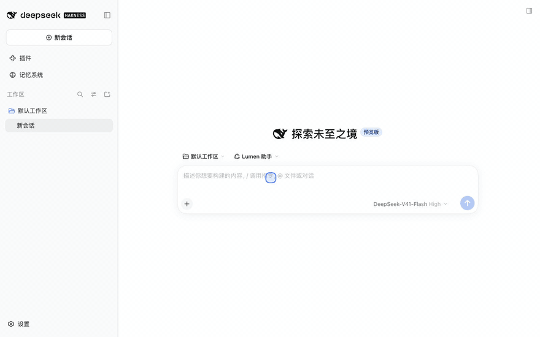

### 回合记忆栏

用到记忆的回复末尾会有一行**本回合记忆**，前面是记忆系统的脑形标识，后面是这一轮的召回、档案检索与写入次数。展开后每个工具一行：左边用平常的话写出工具做了什么，例如**项目档案检索**、**记忆空间召回 ×2**，悬停可以看到工具本身的名称；右边列出它读到或写入的内容。


- 点击工具名称，打开记忆系统中对应的页面。
- 点击一条内容，直接在它所在的位置打开：档案在**项目档案**中选中；记忆空间中的记忆在**检索**页作为查询立即执行；运行时记忆的条目在**运行时记忆**中高亮并滚动到它。
- 每个工具最多列出三条，其余以“另 N 条”汇总；只有 id、没有文字的内容不列出。窄屏上内容排在工具名称下方。
- 没有记忆活动的回合不显示这一行。

纠正某个事实时，Agent 会替换对应的运行时记忆，回合记忆栏记下这次写入；点击这条写入即可看到替换后的条目。[观看纠正录屏](../../assets/webui-v0.5.19/zh-CN/correct.mp4)。

| 纠正写入运行时记忆 | 点击写入，运行时记忆中高亮该条目 |
|---|---|
| 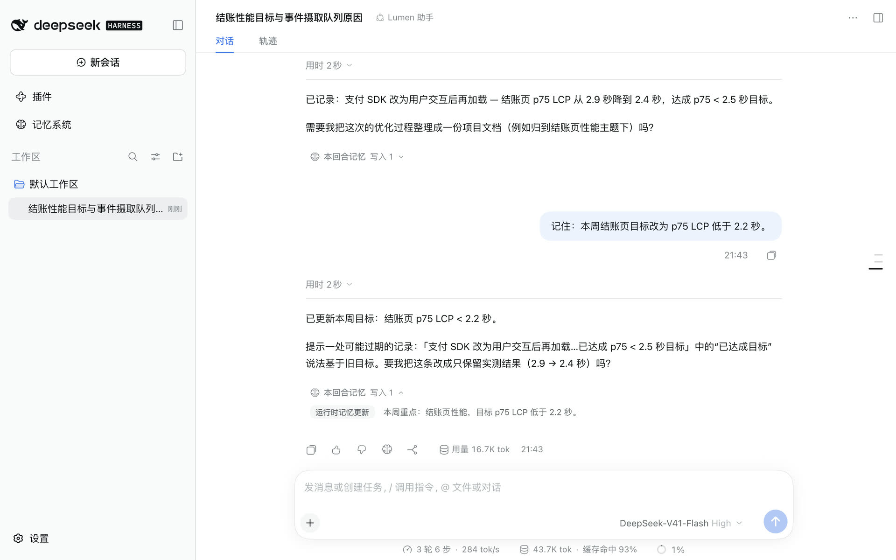 | 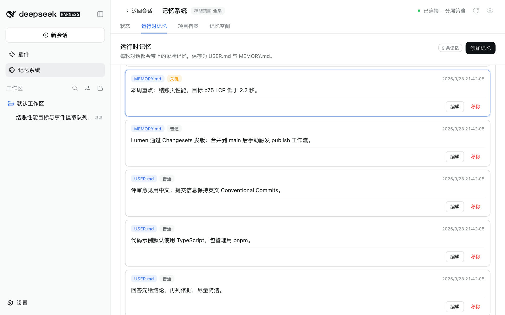 |

临时进度、猜测和密钥不会被写入。

### 存入记忆

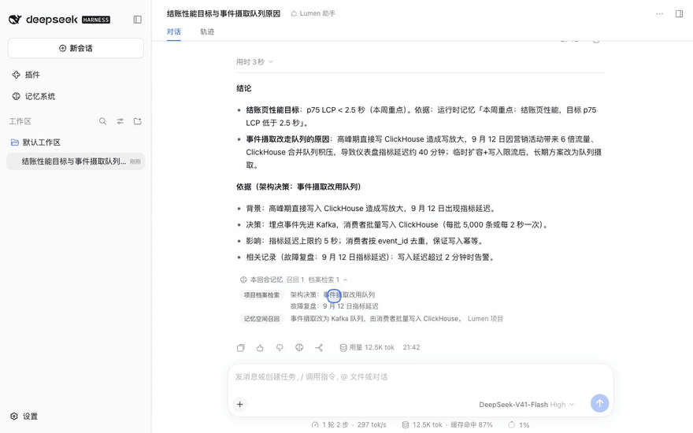

每条已完成回复的操作栏里都有脑形的**存入记忆**，与记忆系统使用同一个标识（旁边数据库形状的图标是 DSH 的用量，与记忆无关）。点击后读取这条回复并打开对话框：

- 标题是**存入记忆**，下方一行说明任务 Agent 会做什么；**任务 Agent 就绪**标签表示可以提交。
- **候选内容（可编辑）**预先填入整条回复，通常只保留要记住的那一句。**取消**不会改动任何数据。
- **交给任务 Agent** 后，一个独立的任务 Agent 判断是否值得保存、选择合适的记忆空间、去重、提炼并写入，不占用当前对话。
- 完成后显示回执：结果标签（**已存入**、**已更新**、**已提交，等待 Provider 确认**、**已跳过**、**部分完成**、**未完成**或**失败**），任务 Agent 用候选内容的语言写出存到了哪个空间，以及**在记忆空间中查看**。此时**取消**变为**关闭**；只有修改了候选内容才能再次提交。

| 编辑候选内容 | 任务 Agent 的回执 |
|---|---|
| 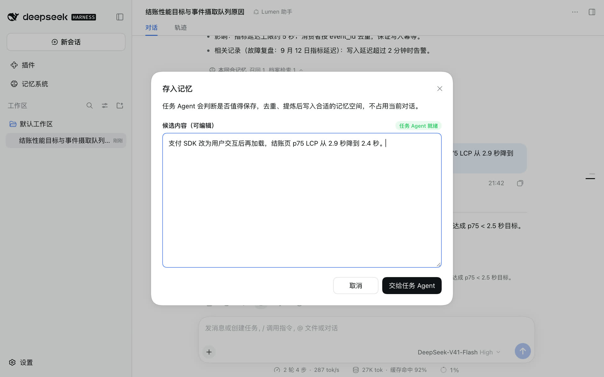 | 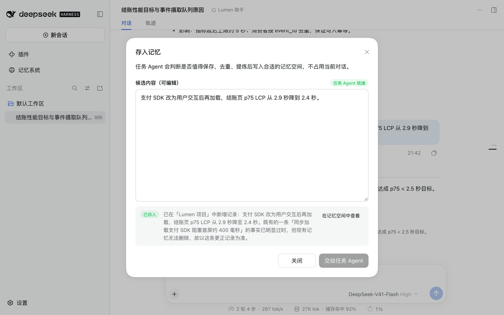 |

记忆空间页顶部的**存入记忆**打开的是同一个对话框。回合记忆栏与存入记忆按钮默认开启，可以在[界面](#界面)中关闭。以会话标签页方式打开时，这些入口会打开来源会话中的记忆系统标签；分屏里有多个候选标签时，请手动打开目标标签。

## 记忆系统

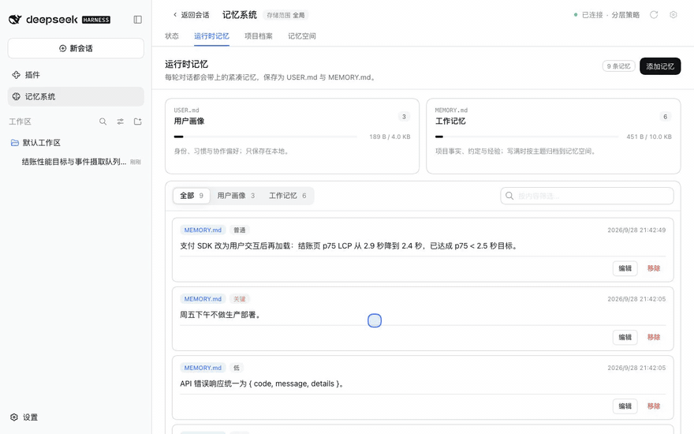

记忆系统有四个页面，名称来自提供它们的组件：**状态**、**运行时记忆**、**项目档案**和**记忆空间**；安装的 Source 也会以同样方式加入自己的页面。顶栏显示连接状态与正在组合记忆的主策略（例如“已连接 · 分层策略”）、存储范围、**刷新**与打开插件页的齿轮。**刷新**重新读取当前页面，所以各页面不再单独放置刷新或同步按钮。

记忆系统默认位于侧栏，回来时停留在原来的页面。从对话里的回合记忆栏打开时，页面会定位到那一条内容；在顶栏切换标签页则打开干净的页面。在**界面 → 记忆系统入口**中选择**会话标签页**，即可改为在会话内打开，页面完全相同。**返回会话**或 Esc 回到对话。

### 状态

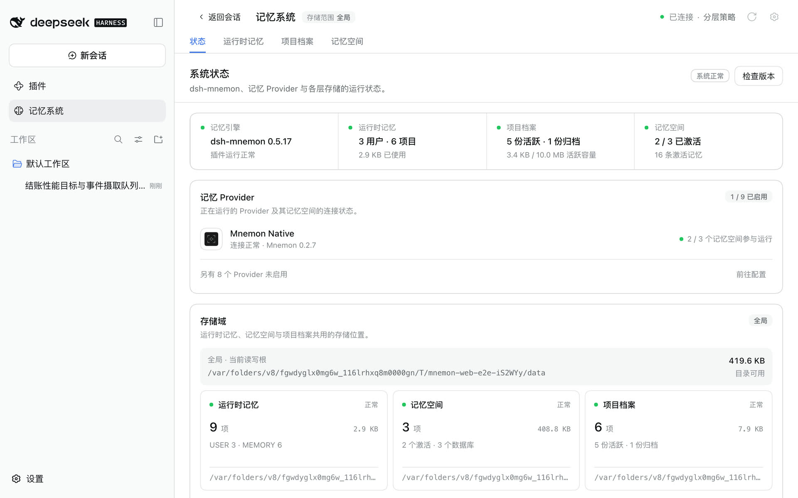

第一行每个组件一张卡片：先是记忆引擎及其版本，然后是各个 Source 保存的内容。下方的**记忆 Provider** 只列出正在运行的 Provider 及其记忆空间的连接状态，其余汇总为一行“另有 N 个 Provider 未启用”，旁边的**前往配置**打开插件页；再往下是存储域。各区域独立加载，一处失败不会遮住其他内容。

只有记忆需要处理时，页面上方才会出现带**前往配置**的提示：

- **记忆未生效**：没有主策略在运行，对话会在没有记忆的情况下继续。
- **所选主策略没有运行**：暂时由另一个策略组合记忆。
- **最近的组件变更没有生效**：继续使用之前的组合。

**检查版本**只读取信息：它会说明 Mnemon CLI 是缺失、最新还是可更新，并给出可复制的 npm 命令；还会列出每个子包的已安装、已发布与锁定版本。更新包后请重启 `dsh web`。

### 运行时记忆

运行时记忆是每一轮都会注入的紧凑上下文。**用户画像**（`USER.md`）记录你是谁、你的偏好与协作规则；**工作记忆**（`MEMORY.md`）记录项目事实、环境、决策与经验。每张卡片显示已用大小与上限。从回合记忆栏打开时，本回合写入的条目带有高亮边框，见[上文的纠正示例](#回合记忆栏)。

- 条目按时间倒序排列，可以按目标与文本筛选；编辑旧条目不会改变它的位置。**添加记忆**打开添加运行时记忆的对话框。
- 条目应简短、相互独立、会被反复用到；临时进度和原始日志不应放在这里。
- 工作记忆条目可以限定 git 分支，只有会话工作区处于这些分支时才会注入；页面和磁盘上的文件不受影响。
- 工作记忆达到上限时，宿主会先把最旧的条目归档到记忆空间，再添加新条目。

<details>
<summary>编辑、容量与分支细节</summary>

“编辑”和“移除”在所属目标中按完整内容匹配条目，因此可以只修改简短的 `X`，而不影响 `EGO_LINUX_CHROME`。同一目标中完全相同的条目无法区分，会被拒绝且不改动数据。

容量归档移动的是原始条目。某一批路由失败或返回无效提案时，这一批会写入符合条件的默认记忆空间或第一个符合条件的空间，摘要中会记录原因。当前回合创建或激活的空间，在激活并支持写入后也可以接收归档。没有可用目标时，已有条目保持不变，待添加的条目也不会保存；排除原因后重新提交即可。

Agent 写入用户画像时，`branches` 必须省略或为空。对工作记忆执行替换时，`branches: []` 会清除分支限定，省略则保持原样。面向模型的快照会为每个条目附上重要性与天数，只作用于新的一轮，不改变已保存的文本。参见[投影格式与上限](../reference/storage-model.md#事实源和投影)。

</details>

### 项目档案

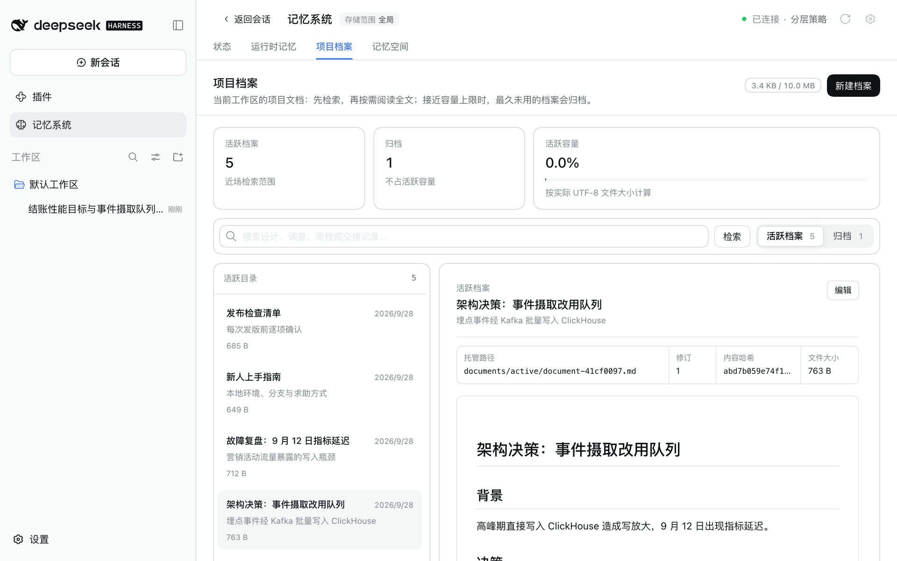

项目档案保存完整的叙事：设计、调查、流程与交接。请先选择 DSH 工作区；即使使用全局存储，档案也属于某个工作区。

- 在**活跃档案**与**归档**之间切换；阅读器保留标题、检索描述、来源、修订、哈希、大小与完整 Markdown。
- 检索会匹配标题、描述与正文；列表按创建时间倒序，更新旧档案不会把它移到最前。
- 项目中的源文件永远不会被修改，档案是受管理的副本。
- 归档会先在记忆空间中为档案建立索引，再移动原文件，因此冷数据仍然可以检索到；目标空间必须已激活，并支持精确写入与安全遗忘。

<details>
<summary>归档与后台审查细节</summary>

显式归档或容量维护时，一个没有记忆工具的独立任务 Agent 会提出摘要和一个符合条件的记忆空间。宿主校验后补充冷存储路径与内容哈希，写入索引并记录来源，然后才移动原文件。提案无效时不改动任何数据。移动失败时，宿主只删除刚刚创建的索引；已有且经过验证的索引会被复用，不会被删除。清理失败或 Provider 结果不确定时，请先检查报告中的目标再重试。

后台审查不会修改已有档案：它先检索，跳过已覆盖的内容，只在有大量新知识时另建补充档案；容量不足时直接跳过。它复用已完成对话中已有的证据，不能重新打开文件。

</details>

### 记忆空间

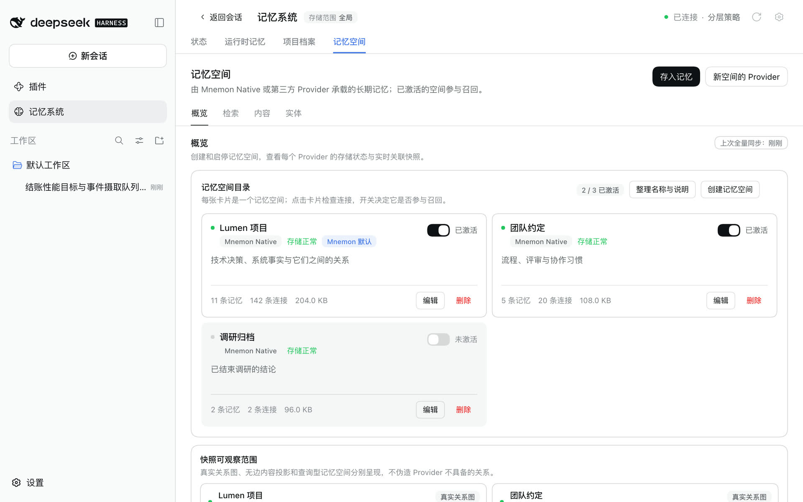

记忆空间是某个 Provider 上一个具名的长期证据范围。**概览**以卡片列出各个空间：卡片上的开关决定 dsh-mnemon 是否读取它，标签写明所用的 Provider（例如 Mnemon Native）；点击卡片只重连这一个空间。右上角是**存入记忆**与**新空间的 Provider**，概览旁边是**检索**、**内容**与**实体**。

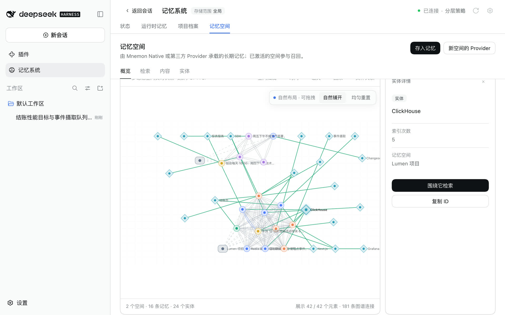

卡片下方的图谱合并了各个已激活空间能提供的内容：记忆、实体以及它们之间的连接。选中空间、实体或记忆，右侧会显示它的上下文，图中是 ClickHouse 实体与**围绕它检索**。布局、拖动与重置只改变显示方式。底部统计空间、记忆与实体的数量，以及当前绘制的元素数。

每个空间都会声明其 Provider 真正能提供什么：Mnemon Native 提供带类型的关系；Hindsight 与 Holographic 提供各自的图谱；没有关系边的 Provider 只贡献内容；ByteRover 这类仅支持查询的 Provider 要等你提问。不支持的能力不会被凭空补出来。

- **创建记忆空间**时总是由你选择 Provider，就绪的 Provider 排在前面；未启用的 Provider 可在[记忆空间页面](#memory-spaces-page)中启用。
- **新空间的 Provider** 只影响任务 Agent 需要新建空间的时候：**固定 Provider** 让新空间总是建在你指定的 Provider 上；**智能选择规则**先由宿主执行数据边界与能力要求，再由任务 Agent 在合格候选中选择。已有空间仍按名称与说明路由。
- **整理名称与说明**会对选中的每个已激活空间取样，由独立任务 Agent 建议标题与说明；各空间独立运行，失败只显示在对应卡片上。

#### 检索

| 直接检索 | Agent 查询 |
|---|---|
|  | 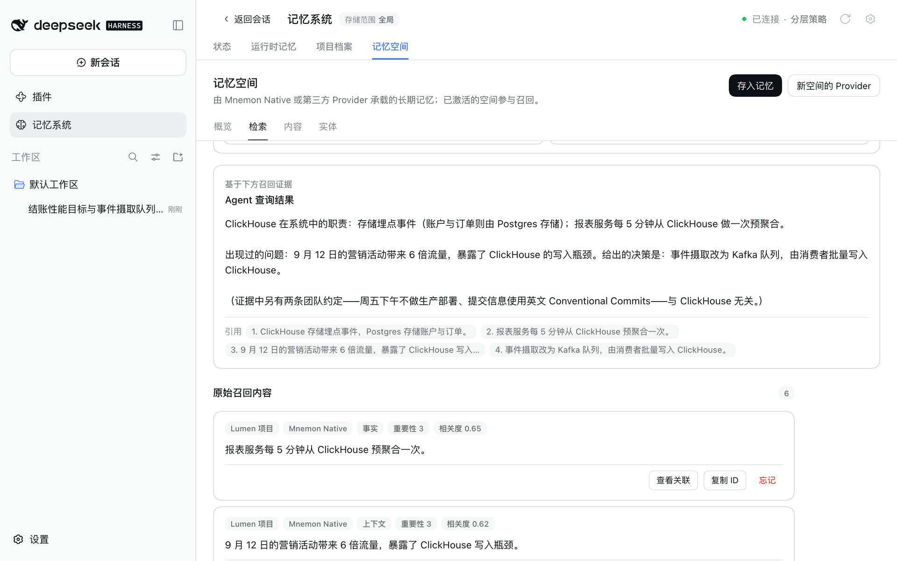 |

**直接检索**不经过 Agent，直接返回各个已激活空间的原始证据，保留各 Provider 自己的分数、空间与分类。**Agent 查询**先做同样的检索，再把证据交给只读的任务 Agent 作答；回答用证据的内容说话，下方的**引用**按内容列出它用到的记忆，不显示 id。各 Provider 并行返回，一处失败不会遮住其他结果。**查看关联**与**忘记**只在 Provider 支持时出现。带着查询打开检索页时（来自回合记忆栏、**围绕它检索**或**查看关联**），查询会立即执行。具体的问题通常比零散的关键词更可靠。

#### 内容与实体

| 内容 | 实体 |
|---|---|
| 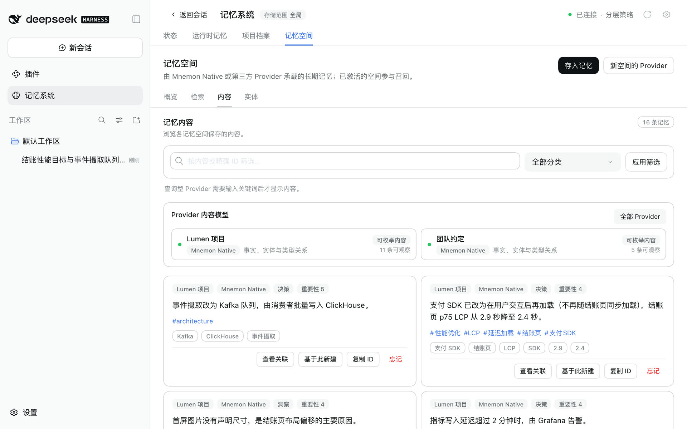 | 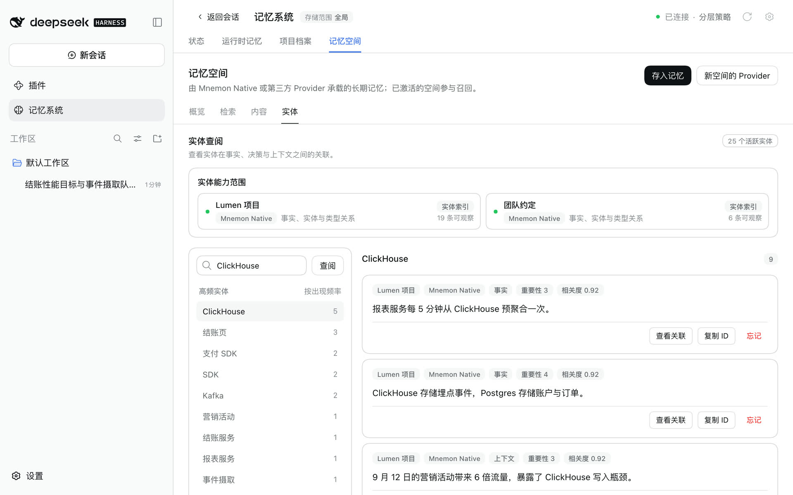 |

**内容**在 Provider 可以枚举时列出记忆，查询型 Provider 需要输入关键词后才显示内容。**实体**只使用真正的实体索引，目前是 Mnemon Native、Hindsight 与 Holographic；选中一个实体，会跨空间汇集提到它的记忆。

#### 存入记忆

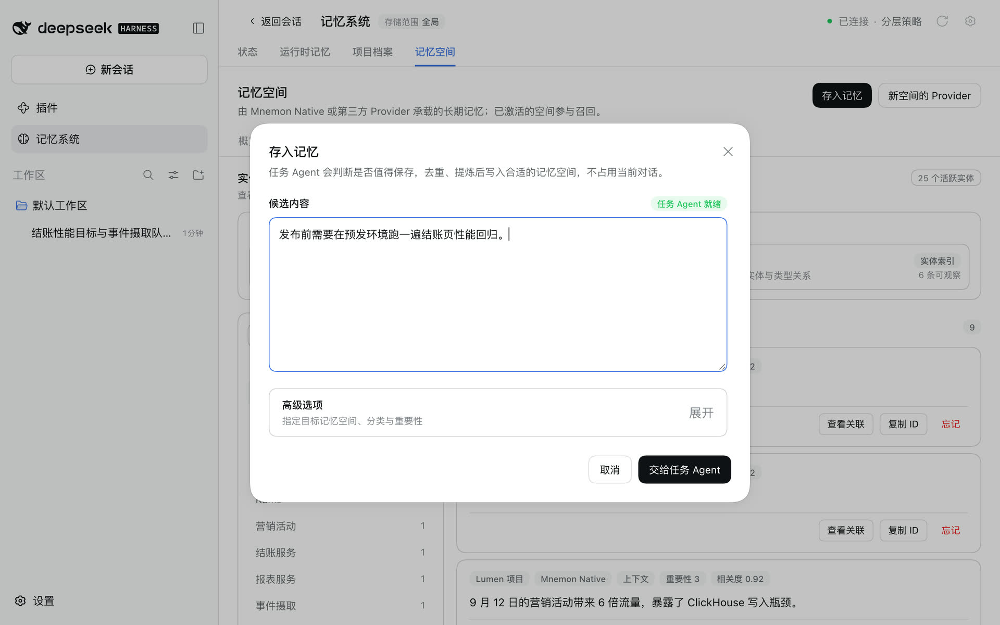

这里的**存入记忆**与对话中的是同一个对话框：写下候选内容，交给任务 Agent，收到回执后可以在**内容**中查看。只有确实需要限定目标、分类或重要性时，才展开**高级选项**。

### 窄屏

| 对话 | 记忆空间 | 配置 |
|---|---|---|
| 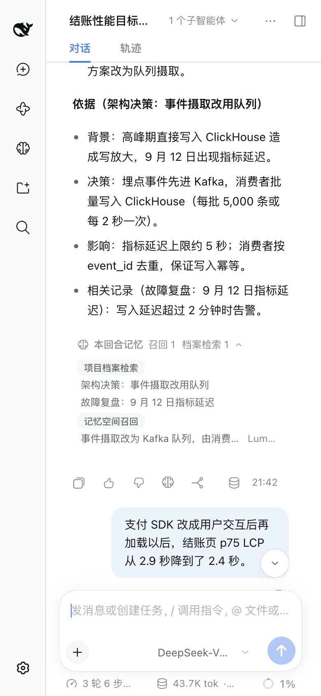 | 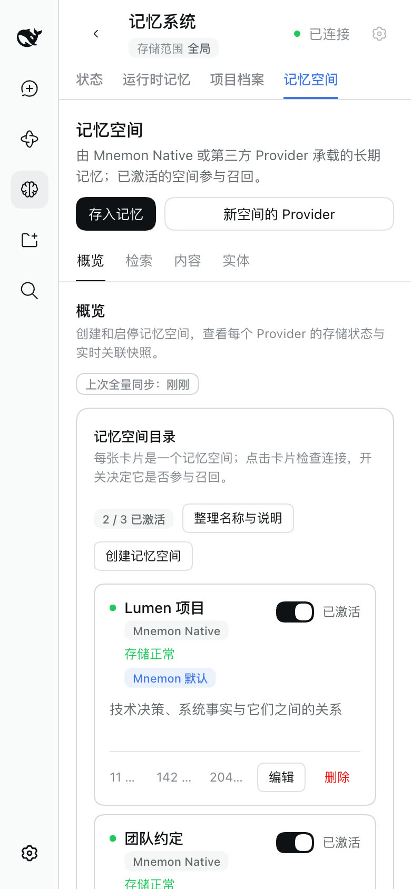 | 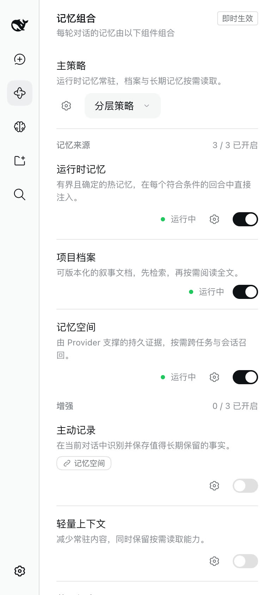 |

在 390 像素宽度下，侧栏变为 DSH 的图标栏，页面内容纵向排列，较长的名称会被截断。这些截图不代表完整的手机支持，参见[已知限制](../reference/compatibility.md)。

## 在插件页中

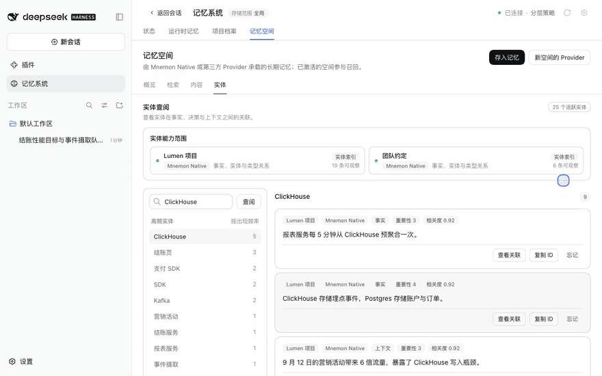

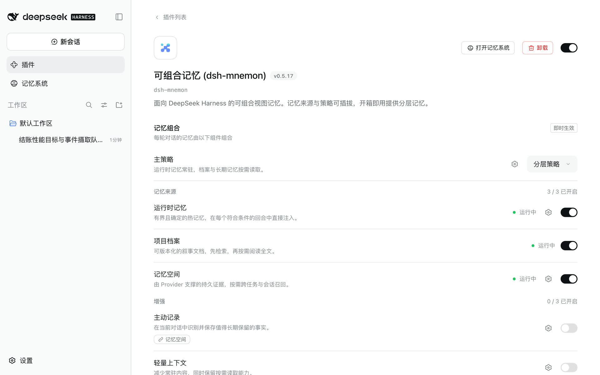

DSH 0.1.7 把插件配置放在“插件”中该插件自己的页面里。“可组合记忆”页面依次是**记忆组合**、**存储**与**界面**，下面是 DSH 列出的 Starter 所含组件；顶部的**打开记忆系统**可以返回工作区。每个组件自己的设置都在它的组件页中。

| 位置 | 包含 | 生效方式 |
|---|---|---|
| 记忆组合 | 主策略；每个记忆来源与增强各一个开关 | 立即生效，作用于之后的回合 |
| 存储 | 存储范围、数据目录、备份与迁移 | 范围与目录点击其**应用**；导入、导出 ZIP 立即执行 |
| 界面 | 记忆系统入口、回合记忆栏、存入记忆按钮 | 立即生效 |
| 运行时记忆页面 | 用户画像范围 | 立即生效 |
| 记忆空间页面 | 记忆 Provider 与 Mnemon Native 嵌入 | 开关立即生效；连接参数点击**应用** |
| 分层策略页面 | 任务 Agent 模型与空闲审查 | 选择立即生效；审查参数点击**应用** |

在其他窗口保存的改动，或直接编辑 Profile 的结果，无需刷新即可显示。

### 记忆组合


- **主策略**是一个选择器，列出每个已安装的主策略及其说明。**分层策略**让运行时记忆常驻，按需读取项目档案与记忆空间，并执行后台维护；**通用策略**在同一份预算内提供全部可用来源，由模型决定如何使用，不做自动审查与容量维护。
- 下面是**记忆来源**与**增强**，每个组件一行，显示状态、开关，有自己设置的组件还有齿轮。标签写明这一行依赖的组件或依赖它的组件，点击即可打开对应页面。
- 只有记忆没有按你的选择组合时，才会出现一行问题说明，并给出能解决它的那个开关。

每个开关都作用于之后的回合，已经开始的回合保留原有的 View。打开一个组件时，它依赖的组件会一起打开，不能与它共存的组件会被关闭；关闭一个组件时，依赖它的组件也会关闭；选择一个主策略时，其他主策略会被关闭。最后一个运行中的来源不能关闭。开关影响到其他组件或改变了组合方式时，DSH 会弹出提示，并提供**撤销**。

### 组件页

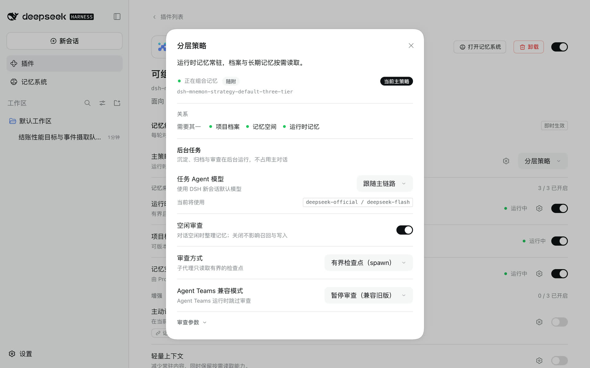

行上的齿轮、**主策略**旁边的齿轮，以及任何位置出现的组件名称，都会打开该组件的页面。页面显示组件的状态与开关、它是随附组件还是来自已安装的包、它依赖什么、谁依赖它、不能与谁共存、声明的选项以及它自己的设置；关联组件在原处打开，可以**返回**。选项会按宿主的限制校验，有改动时才出现**应用**，**恢复默认**可以还原单个选项。

<a id="memory-spaces-page"></a>

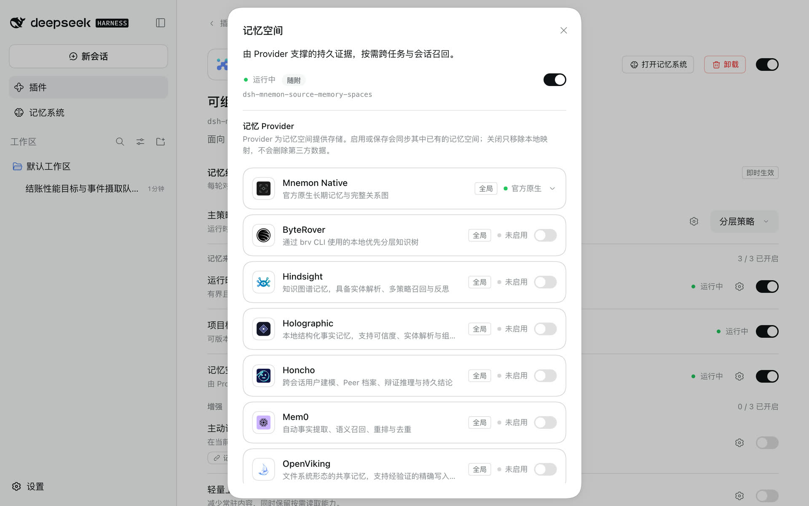

- **运行时记忆页面**：**用户画像范围**。“全局共享”把全局的 `USER.md` 与工作区或自定义目录中的 `MEMORY.md` 组合使用，不移动任何一方。
- **记忆空间页面**：**记忆 Provider**。Mnemon Native 排在第一位，展开后只包含它的嵌入设置；每个第三方 Provider 都有自己的开关且默认关闭，打开后才显示服务地址、密钥等字段。“全局”或“工作区”标签表示实际作用范围。OpenViking 的 **User Key 所属用户（跳过 Admin）** 用于没有 Admin 权限的密钥，参见[其限制](./memory-providers.md#运维边界)。
- **分层策略页面**：**后台任务**。**任务 Agent 模型**默认跟随 DSH 新会话的默认链路，也可以**指定模型**，选择一对完整的 Provider 与模型；它作用于存入记忆、Agent 查询、整理名称与说明、新空间的智能选择与档案归档，不会改变主对话的模型。**空闲审查**、**写入运行时记忆**、审查方式与 Agent Teams 兼容模式立即生效，**审查参数**点击**应用**后生效。关闭**写入运行时记忆**后，审查只创建项目档案。审查只在分层策略组合的回合之后运行，参见[配置](../reference/configuration.md#provider-要求)。

<details>
<summary>Mnemon Native 嵌入</summary>

展开 Mnemon Native 卡片。**由 DSH 管理嵌入配置**打开后，已保存的服务地址、模型、协议和可选密钥会成为 Mnemon 子进程的唯一配置，包括不读取 shell 启动文件的桌面端启动；这些字段随后显示，并通过**应用**一起生效。自动协议选择把以 `/v1` 结尾的地址视为 OpenAI 兼容，其他地址需要明确选择协议。地址中不能包含凭据、查询参数或片段。记忆与查询文本会发送到所配置的服务。**测试状态**检查的是已保存的值，而不是未保存的草稿。开启前请阅读[嵌入配置](../reference/configuration.md)。

</details>

### 存储

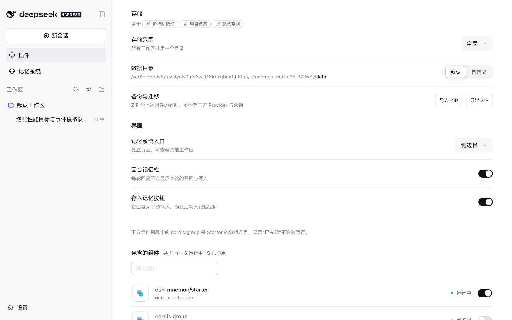

**存储**先列出把数据保存在这个目录中的组件，点击名称即可打开对应的组件页。

- **存储范围**：**全局**让所有工作区共用一个目录；**工作区**把每个工作区的记忆放在它自己的 `.mnemon` 中；**集中存储 · 按工作区隔离**在同一个根目录下为每个工作区建立 `workspaces/<工作区路径哈希>/`。
- **数据目录**：在**默认**与**自定义**之间选择，这一行只显示记忆正在使用的一个目录。默认目录是 `MNEMON_DATA_DIR` 或 `~/.mnemon`；自定义时填写绝对路径或以 `~/` 开头的路径，集中存储下它是根目录。输入框留空只表示尚未填写，回到默认目录请选择**默认**。
- 范围与目录一起点击**应用**，应用前会说明后果：记忆改为读写新位置，已有数据不会被移动、合并或删除。

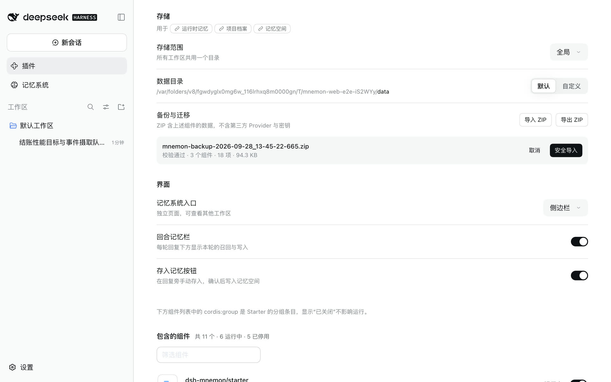

**备份与迁移**把当前数据目录中“存储”所列组件的数据导出为 ZIP，不包含第三方 Provider 的数据与凭据。导入时先显示校验后的内容预览，**安全导入**把它合并到当前目录。参见[备份与恢复](./operations.md#备份与恢复)。

### 界面

- **记忆系统入口**：**侧边栏**（默认）或**会话标签页**。
- **回合记忆栏**与**存入记忆按钮**分别开关对话中的两个控件。

### DSH 组件列表

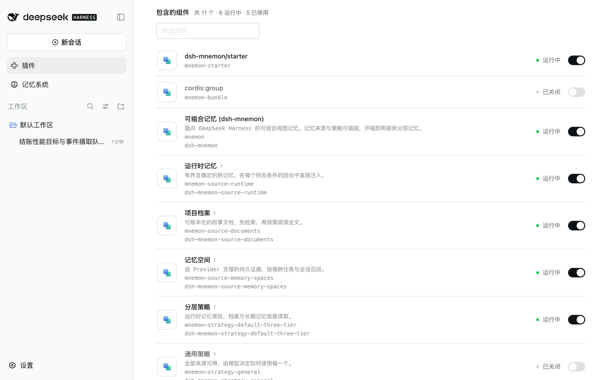

配置下方，DSH 以组件声明的名称和说明列出 Starter 所含的组件。`mnemon-bundle` 是 Starter 的分组条目（0.5.20 起显示为 `dsh-mnemon/bundle`；上图来自 0.5.19，当时名为 `cordis:group`，其上方的 `dsh-mnemon/starter` 是当时单独的就绪条目），它显示“已关闭”不影响任何功能。点击组件名称会打开 DSH 为它提供的页面，其中是与记忆组合面板相同的组件页。

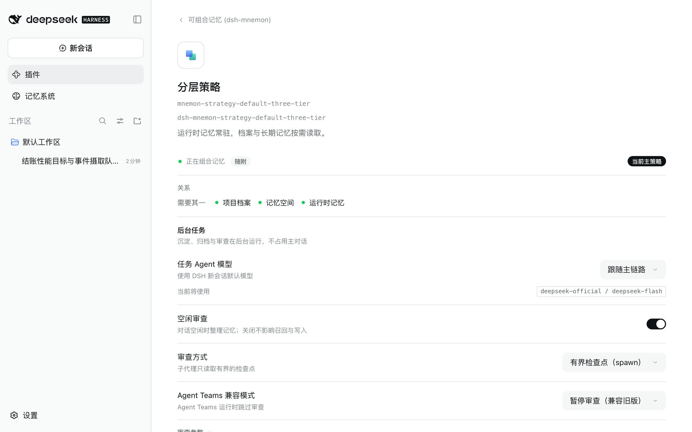

## 查看的工作区与执行的工作区

| 概念 | 由谁选择 | 影响 |
|---|---|---|
| **查看的工作区** | 记忆系统顶栏 | 页面显示和编辑哪个 `<workspace>/.mnemon` |
| **执行的工作区** | 当前对话的工作目录 | 对话工具、命令与生命周期钩子使用哪个根目录 |

你可以在项目 A 的对话中查看项目 B。对话仍然作用于 A；从记忆系统发起的存入记忆、Agent 查询、整理名称与说明与档案归档，会以限定于 B 的任务 Agent 运行。远程 Provider 的命名空间不会随 DSH 工作区变化。全局与自定义存储只对应一个根目录，无需对齐。

<a id="theme-skin-overrides"></a>

## 主题与皮肤覆盖

皮肤作者可以先阅读[皮肤开发与 Mnemon 集成](../development/skin-integration.md)，其中有示例、从生成类名迁移的方法以及在真实 WebUI 中的验证步骤。本节定义受支持的契约。

侧栏与会话标签页使用同一个工作区根元素：`[data-dsh-plugin="dsh-mnemon"][data-dsh-part="mnemon-view"]`。请直接在该元素上设置以下自定义属性；设置在祖先元素上的值会被工作区默认值覆盖。生成的 CSS module 类名不是公开选择器。

| 属性 | 可接受的值与用途 | 默认值 |
|---|---|---|
| `--mn-bg` | 基础表面的 CSS 颜色 | `var(--dsw-alias-bg-base)` |
| `--mn-backdrop` | 默认分层表面中位于基础色之后的 CSS 颜色 | `var(--dsw-alias-bg-overlay, var(--mn-bg))` |
| `--mn-surface` | 工作区、顶栏与画布使用的 CSS `background` 值 | 基础渐变叠加在背景渐变之上，并以基础色兜底 |

默认表面为 `linear-gradient(var(--mn-bg), var(--mn-bg)), linear-gradient(var(--mn-backdrop), var(--mn-backdrop)) var(--mn-bg)`。当皮肤把宿主基础色设为透明时，这层叠加保证文字依然清晰；官方主题保持不透明。皮肤可以整体替换这一组合，例如：

```css
[data-dsh-plugin="dsh-mnemon"][data-dsh-part="mnemon-view"] {
  --mn-bg: rgb(232 241 249 / 74%);
  --mn-backdrop: var(--mn-bg);
  --mn-surface: var(--mn-bg);
}
```

请在未分层（unlayered）的样式表中使用这对选择器。它的优先级 `(0,2,0)` 高于默认声明的 `(0,1,0)`，无论皮肤样式先于还是晚于 Mnemon 加载都能生效。单独的 `[data-dsh-part="mnemon-view"]` 与默认值优先级相同，取决于加载顺序；写在 `@layer` 中的普通声明低于未分层的默认值。需要激活范围时，请加上皮肤自己的祖先选择器。挂载到 body 的对话框与其他插件的根元素不在此范围内。替换 `--mn-surface` 意味着由皮肤自行负责可读性与透明度，它不会改变设置、记忆数据或 Provider 行为。

## 交互约定

记忆相关的界面在各处遵循同一套约定：

- **一个标识**：对话中的回合记忆栏、存入记忆按钮与侧栏的记忆系统都使用脑形标识；DSH 的数据库形状图标表示用量，与记忆无关。
- **一个名称，一个对话框**：写入长期记忆的操作在各处都叫**存入记忆**，打开同一个对话框，由任务 Agent 完成并给出回执。
- **名称优先于标识符**：界面用标题、内容与空间名称指代记忆，不显示原始 id 或路径；需要时卡片上的**复制 ID** 仍然可用。
- **统一的控件**：搜索框、选择项、开关与对话框按钮使用 DSH 的输入框、选择器、开关与描边“取消”；菜单与提示显示在对话框上方。
- **刷新只在顶栏**：**刷新**重新读取当前页面；各页面不再单独放置刷新或同步按钮。
- **操作的轻重**：主要操作使用 DSH 主按钮，编辑等次要操作使用描边按钮；红色只用于删除、断开、归档与忘记。
- **说明一行**：各页与各分组的说明控制在一行以内，细节放在对应的指南中。
- **状态只列运行中的部分**：状态页列出正在运行的 Provider，其余汇总为一行，并提供前往配置。

另外：记忆空间的开关只决定 dsh-mnemon 是否读取它，与 Mnemon CLI 的默认 Store 无关；删除 Mnemon Native 空间需要确认，外部空间使用“断开”，不会改动 Provider 中的数据；反复点击（包括选择已选中的值）都不会让页面变空白。

下一步：[能力地图](./capabilities.md) · [快速开始](./getting-started.md) · [Provider 指南](./memory-providers.md) · [配置参考](../reference/configuration.md)
